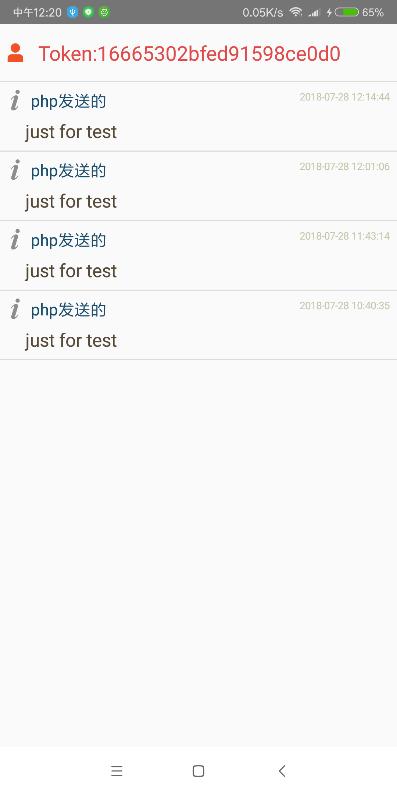
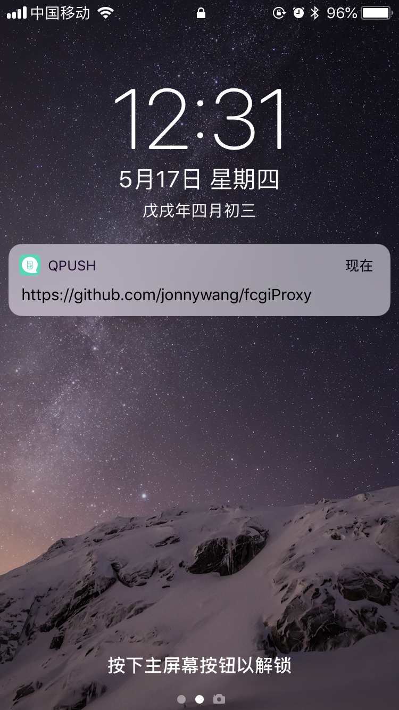
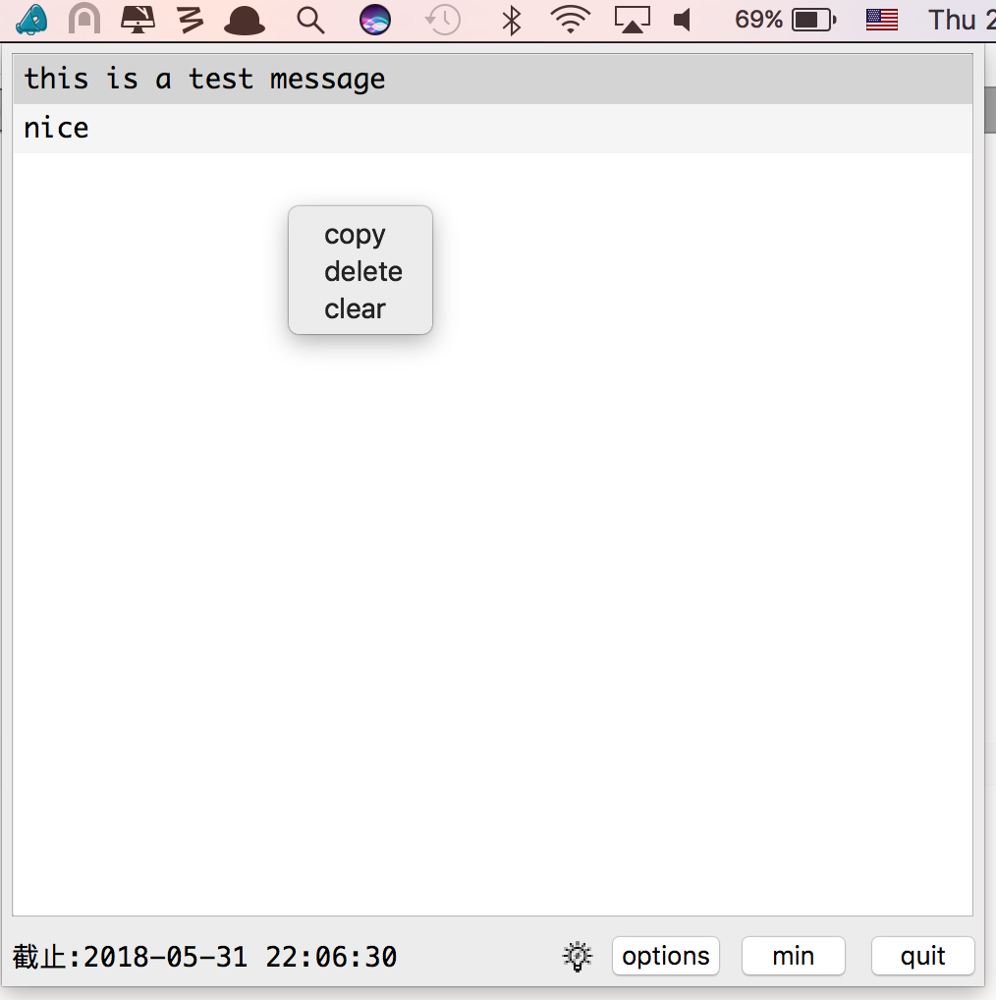
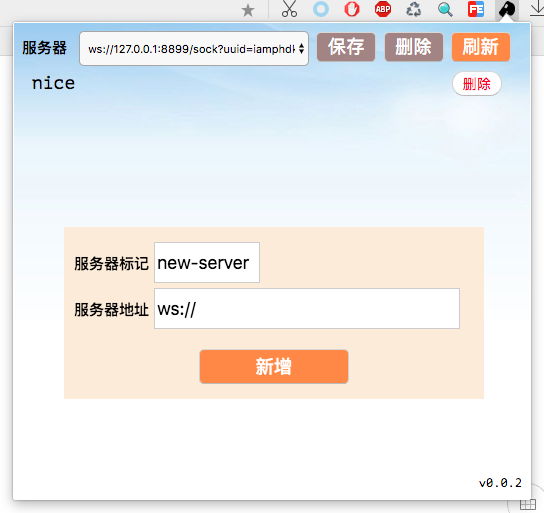

### version 0.1.7

### description
* 客户端通过websocket可直接请求php-fpm下php代码，php可通过内置redis协议服务与客户端完成通信
* 推送指定信息到手机，电脑等

### tutorial
* https://www.ixqbar.com/2018/08/21/fcgiProxyTutorial/

### usage
```
fcgiProxy --config=config.xml
```
* redis      0.0.0.0:6899
* websokcet  ws://127.0.0.1:8899/sock[?uuid=指定连接客户端标记，可选&channel=推送频道，可选&proxy=是否代理默认否，可选]

### config
```
<?xml version="1.0" encoding="UTF-8" ?>
<config>
    <admin_server>0.0.0.0:6899</admin_server>
    <!-- http[s] -->
    <http_server>0.0.0.0:8899</http_server>
    <!-- ssl cert -->
    <http_ssl_cert>/data/ssl/server.crt</http_ssl_cert>
    <http_ssl_key>/data/ssl/server.key</http_ssl_key>
    <http_rc4_key></http_rc4_key>
    <!-- enable http static file path -->
    <http_static_root>/data/resource</http_static_root>
    <!-- fastcgi 逗号分隔可以支持多个 -->
    <fcgi_server>0.0.0.0:9000</fcgi_server>
    <script_filename>/Users/xingqiba/workspace/php/gateway.php</script_filename>
    <query_string><![CDATA[name=xingqiba&version=0.1.7]]></query_string>
    <header_params>
        <param>
            <key>FcgiVersion</key>
            <value>0.1.7</value>
        </param>
    </header_params>
    <!-- allow websocket origins to access -->
    <origins>*</origins>
    <!-- logs -->
    <logger>
        <!-- empty is no encrypt -->
        <rc4_encrypt_key>hello</rc4_encrypt_key>
        <!-- record logs to mysql-->
        <mysql>
            <ip>127.0.0.1</ip>
            <username>root</username>
            <password></password>
            <port>3306</port>
            <database>logs</database>
        </mysql>
    </logger>
    <proxy>
        <server>socks://127.0.0.1:8016</server>
    </proxy>
    <qpush>
        <device>{group},{name},{code}</device>
    </qpush>
    <apush>
        <url>https://api.pushy.me/push?api_key={YOUR KEY}</url>
        <device>{group},{name},{token}</device>
    </apush>
</config>
```

### fcgi通过redis协议推送消息给客户端
```
ping
ping {message}
uuid                        #生成一个uuid
set {uuid} {message}        #给指定客户端推送text消息    uuid可通过$_SERVER['PROXY_UUID'] 获取 或者连接ws参数uuid指定
set {uuid} {message} 1      #给指定客户端推送binary消息  uuid可通过$_SERVER['PROXY_UUID'] 获取 或者连接ws参数uuid指定
setex {uuid} 0 {message}    #给指定客户端推送text消息    uuid可通过$_SERVER['PROXY_UUID'] 获取 或者连接ws参数uuid指定
setex {uuid} 1 {message}    #给指定客户端推送binary消息  uuid可通过$_SERVER['PROXY_UUID'] 获取 或者连接ws参数uuid指定
set * {message}             #给所有客户端推送text消息
set * {message}  1          #给所有客户端推送binary消息
setex * 0 {message}         #给所有客户端推送text消息
setex * 1 {message}         #给所有客户端推送binary消息
number                      #获取在线人数
del *                       #剔除所有在线客户端
del {uuid}                  #剔除指定在线客户端， uuid可通过$_SERVER['PROXY_UUID'] 获取 或者连接ws参数uuid指定
subscribe {channel}         #订阅频道  系统默认频道*
publish {channel} {message} #发布text消息到指定频道
rpush {nothing} {proxy_server_content}  #推送用于qpush的代理配置
exists {uuid}               #确认客户端uuid是否在线

qpush * {message}                                      #qpush 推送消息给iOS
npush * {"title":"php发送的","message":"just for test"} #推送消息给monitor https://github.com/jonnywang/ctips
apush * {"title":"php发送的","message":"just for test"} #推送消息给android
tpush * {"title":"php发送的","message":"just for test"} #推送消息给iOS android monitor

atoken {name} {token} #刷新android推送对应name的token 

addfcgiserver 192.168.1.100:9000     #增加fcgi server
removefcgiserver 192.168.1.100:9000  #删除fcgi server
```
* rpush用于接收爬虫扫到的代理服务器，用于qpush推送使用
* rpush对应爬虫可以参考 https://github.com/jonnywang/sockslistnet
* apush的app安装apk请参考 https://github.com/jonnywang/apush

### pub&sub
```
<?php

ini_set('default_socket_timeout', -1);

$redis_handle = new Redis();
$redis_handle->connect('127.0.0.1', 6899, 30);
$redis_handle->subscribe(array('*'), function($redis_handle, $chan, $message){
	//服务器间隔5秒发送PING
	if ($message == 'PING') return; 
	echo $chan . '-' . $message . PHP_EOL;
});
```

### http logs
```
curl 'http://127.0.0.1:8899/?format=json'  #获取统计信息
curl --data '{"id":1,"res":"hh","type":"request","data":"not found"}' 'http://127.0.0.1:8899/logs' #提交日志
```
* http://xxx.xxx.xxx.xxx:pppp/
* http://xxx.xxx.xxx.xxx:pppp/logs
* http://xxx.xxx.xxx.xxx:pppp/res

### http push
```
curl -d '{"title":"ok","message":"123"}' "http://127.0.0.1:8899/push?group=*"
```

### log table
```
CREATE TABLE `access_logs` (
 `id` int(11) NOT NULL AUTO_INCREMENT,
 `user_id` int(11) NOT NULL,
 `user_ip` varchar(20) NOT NULL,
 `user_agent` varchar(1024) NOT NULL,
 `resource` varchar(1024) NOT NULL,
 `type` varchar(50) NOT NULL,
 `content` text NOT NULL,
 `time` int(11) NOT NULL,
 PRIMARY KEY (`id`),
 KEY `type` (`type`),
 KEY `user_id` (`user_id`)
) ENGINE=InnoDB DEFAULT CHARSET=utf8;
```

### apush [push message to android]

* https://github.com/jonnywang/apush

### qpush [push message to iphone]
* http://qpush.me/zh_cn/



### ctips [push message to desktop]

* https://github.com/jonnywang/ctips

### whistle [chrome extension]

* https://github.com/jonnywang/whistle

### support
 * qq group 233415606
